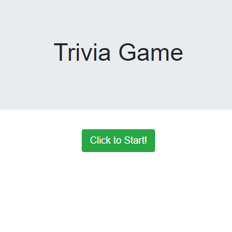

# TriviaGame

## Link to deployed app: [https://plsenh.github.io/TriviaGame/](https://plsenh.github.io/TriviaGame/)

---

## Details & How to Play

- A trivia game that shows only one question until the player answers it or their time runs out.

- If the player selects the correct answer, a screen congratulates them for choosing the right option. After a few seconds, the next question is displayed.

- The scenario is similar for wrong answers and time-outs.

  - If the player runs out of time, the player is told that time's up and the correct answer is displayed. After a few seconds, the next question is shown.
  - If the player chooses the wrong answer, the player is told they selected the wrong option and the correct answer is displayed. After a few seconds, the next question is shown.

- On the final screen, the player sees the number of correct answers, incorrect answers, and an option to restart the game.

---

## Built with:

- [Bootstrap](https://getbootstrap.com/) - Front-end component library for developing with HTML, CSS, and JS.
- CSS3
- HTML5
- [JavaScript](https://developer.mozilla.org/en-US/docs/Web/JavaScript) - High-level programming language.
- [jQuery](https://jquery.com/) - JavaScript library.
- [Visual Studio Code](https://code.visualstudio.com/) - Source code editor developed by Microsoft.

---

## Author:

- **Pauline Senh** - [plsenh](https://github.com/plsenh)
